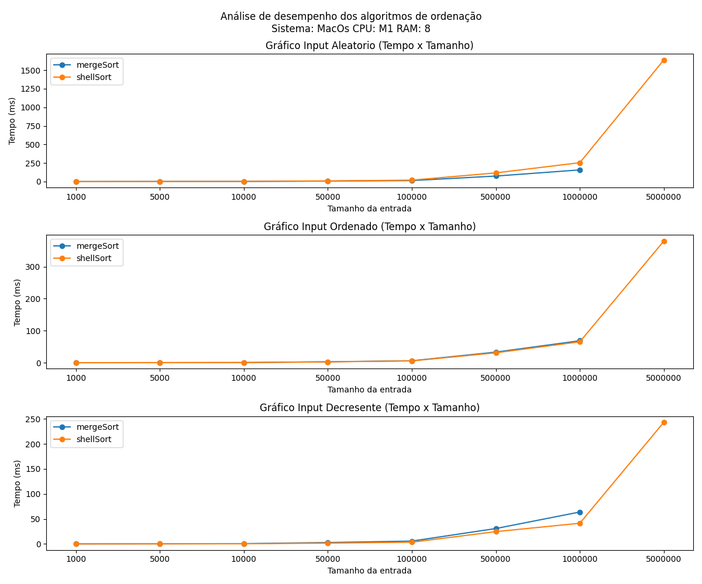
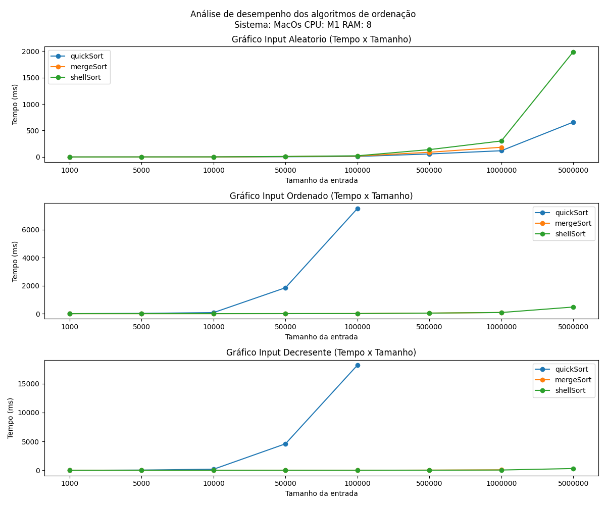
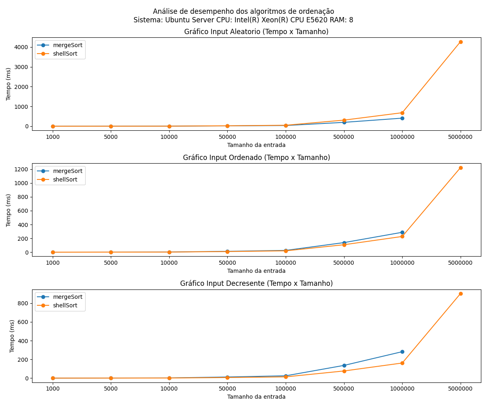
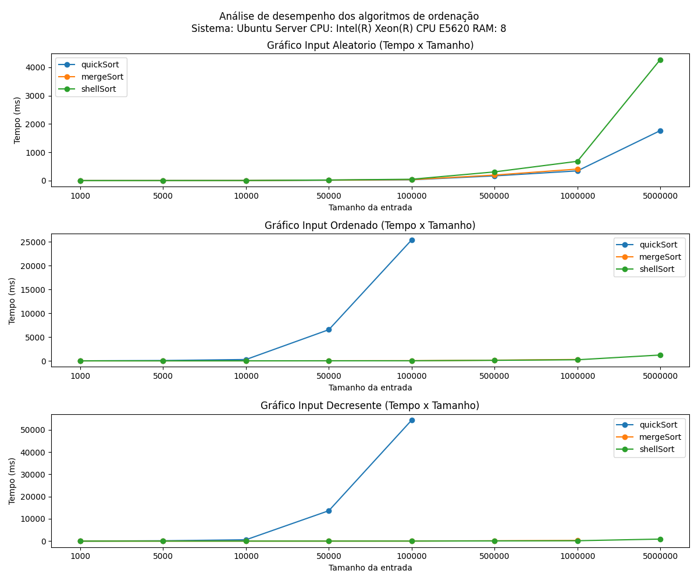

# Script em python Equipe 1

## Execuçao do script randon
- Windows 
```
python .\Script_random.py 
```
- Linux 
```
python3 .\Script_random.py 
```

## Alteração do range na variável numeros_aleatorios
numeros_aleatorios = [random.randint(1, 1000) for _ in range(1000)]

## Alteração do nome do arquivo.txt
with open('A.txt', 'w') as file:
with open('O.txt', 'w') as file:
with open('D.txt', 'w') as file:

## Saida dos repositorios em arquivo .txt
- Arquivos Aleatorios saida A.txt
- Arquivos Ordenados saida O.txt
- Arquivos Decrescentes Saida D.txt

# Resultados dos testes 

foi realizado os teste em duas maquinas distintas para comparação dos resultados

## Processador M1 8GB de ram

---

## graficos

Foi feito dois graficos separados para melhor visualização dos dados pois o quickSort teve um tempo de execução muito maior que os outros dois algoritmos.

### mergeSort e shellSort



### mergeSort, shellSort e quickSort



## Processador Intel(R) Xeon(R) E5620 8GB de ram

---

## graficos

Foi feito dois graficos separados para melhor visualização dos dados pois o quickSort teve um tempo de execução muito maior que os outros dois algoritmos.

### mergeSort e shellSort



### mergeSort, shellSort e quickSort



# Artigos Aula 10/4

### Artigo 00

#### Algoritimo

<!--Poderiam acrescentar breves explicação sobre cada algoritmo apresentado no artigo, destacando seus pontos principais e como eles se comparam-->

*QuickSort Pararelo:* 
É uma versão paralela do algoritmo de ordenação QuickSort. Ele divide o problema de ordenação em subproblemas menores que podem ser ordenados em paralelo, utilizando as capacidades de processamento multi-core de computadores modernos.

*Ordenação por amostragem:* 
É um algoritmo de ordenação que utiliza uma técnica de amostragem para estimar a distribuição dos elementos em um conjunto de dados. A partir dessa estimativa, o algoritmo divide o conjunto de dados em subconjuntos menores que podem ser ordenados de forma mais eficiente.

#### Tecnica de Pararelismo

<!--Descrev com mais detalhes, como o modelo MapReduce foi utilizado para processar os conjuntos de dados de forma eficiente e paralela em clusters de computadores.-->

Para isso foi usado o Mapreduce que é um modelo de programação e uma estrutura de software criada para processar grandes conjuntos de dados (big data) de forma eficiente e paralela em clusters de computadores. Ele simplifica o processamento distribuído dividindo a tarefa em duas fases distintas

#### Linguaguem de Programação
Usando a linguagem JAVA

#### Avaliação experimental

<!--Considerem adicionar gráficos ou tabelas para visualizar melhor os resultados dos experimentos, como os tempos de execução em função do número de partições.-->

1) *Estabilidade do Algoritmo:* 
As dezexecuções do Quicksort Paralelo produzem um tempo
médio de 219 segundos, e coeficiente de variação (razão
entre o desvio padrão e a média) igual a 0,031. No caso
do algoritmo Ordenação por Amostragem, a média dos
tempos é 143 segundos e o coeficiente de variação é igual 
a 0,013. Portanto, oo Quicksort Paralelo apresenta tempos
de execução maiores em todos os conjuntos de dados
testados, bem como maior variabilidade nos tempos de
ordenação.

2) *Variando o Número de Partições:* 
<br>
|~ 200s para duas partições | ~ 180s para quatro partições | ~145s para oito partições |
<br>

Quicksort Pararelo: Foi alterado 
o número de divisões feito no processo
de ordenação para avaliar sua
influência no tempo de execução. Foram realizados testes
variando o número de partições entre 2, 4, 6 e 8. Cada
teste foi executado cinco vezes, em cinco máquinas, com
entrada de 108
chaves em distribuição uniforme. O gráfico relata o tempo médio de ordenação em
função do número de partições. Observa-se um aumento
significativo no tempo de execução do Quicksort Paralelo
à medida que o número de partições aumenta.

|~200 para 2 partições | ~410 para 4 partições| ~580 para 6 partições| ~700 para 8 partições|

Ordenação por amostragem: Em contrapartida, para o algoritmo de ordenação por amostragem graficamente demonstra mais tempo de execução para maiores quantidades de partições


3) *Variando a Distribuição dos Dados:*
Os resultados mostram que o tempo de
ordenação não foi significativamente influenciado pela
distribuição dos dados de entrada. Assim, concluímos que
os algoritmos são robustos em relação à variabilidade dos
dados, uma vez que a distribuição da entrada não teve
influência relevante no tempo de execução.

4) *Variando a Quantidade de Dados:*
Os resultados mostram que os
tempos do algoritmo Ordenação por Amostragem são
entre 12% (para 107
) e 52% (para 1010) menores do
que os tempos do Quicksort.

5) *Variando a Quantidade de Máquinas:*

O tempo médio de execução do algoritmo Quicksort
Paralelo em cinco máquinas foi cerca de 45% menor que o
tempo médio obtido em duas máquinas. Para o Ordenação
por Amostragem o percentual reduzido é ainda maior:
em cinco máquinas reduz-se 57% o tempo necessário
para a execução em duas máquinas


6) *Speedup e Eficiência:*
A medida que o
número de processadores aumenta, o valor da eficiência
decresce, mostrando que a eficiência no uso dos recursos
é menor para maior número de processadores. Esse fato
ocorre mais acentuadamente no algoritmo Quicksort, o
que indica que o algoritmo Ordenação por Amostragem
apresenta melhor utilização dos recursos, resultante de
sua distribuição mais uniforme da computação entre os
computadores.


## Artigo 01

### Algoritimo

*MergeSort*

É uma variação do algoritmo de ordenação MergeSort que utiliza a mesma memória que o array original para realizar a ordenação. Isso significa que ele não precisa de um array auxiliar para armazenar os elementos durante o processo, tornando-o mais eficiente em termos de uso de memória.


### Tecnica de Pararelismo

<!--Seria interessante adicionar AQUI mais detalhes sobre como exatamente as threads são utilizadas para melhorar o desempenho do algoritmo e como isso se relacion a com a execução em paralelo do processo de ordenação-->

Paralelização de uma implementação in-place do algoritmo mergeSort utilizando threads

### Linguaguem de Programação
Usando a linguagem JAVA

### Avaliação experimental


<!--Considerem adicionar gráficos ou tabelas para visualizar melhor os resultados dos experimentos-->
<!--Como foi  possível  melhorar  o desempenho  e  a  eficiência  do  algoritmo ?-->
Observa-se que a redução do tempo de 
execução foi mais significativa para a maior entrada (10 milhões de elementos – linha
superior do gráfico).

