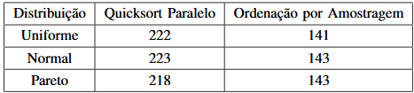
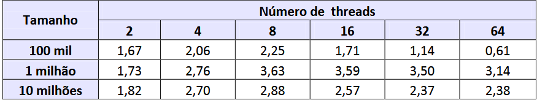

## Artigos

### Artigo #0

 - Algoritmo:
    - QuickSort Paralelo; 
    - Ordenação por amostragem.

- Técnica de Paralelismo:
    - MapReduce  possui  o  objetivo  de  simplificar  a  programação, permitindo  que  programador  foque  no  desenvolvimentode  sua  tarefa,  e  não  nos  detalhes  da  paralelização  dacomputação.
    - A  programação  é  baseada  em  duas  funções  principais,Map  e  Reduce.  A  função  Map  é  aplicada  aos  dados  deentrada e produz uma lista intermediária de pares <chave,valor>. Todos os valores intermediários associados a umamesma chave são agrupados e enviados à função Reduce,que,  por  sua  vez,  combina  esses  valores  para  formar  umconjunto sintético de resultados

- Linguagem de Programação:
    - Java   

- Avaliação Experimental:
    - O  tempo  médio  de  execução  do  algoritmo  QuicksortParalelo em cinco máquinas foi cerca de 45% menor que otempo médio obtido em duas máquinas. Para o Ordenaçãopor  Amostragem  o  percentual  reduzido  é  ainda  maior:em  cinco  máquinas  reduz-se  57%  o  tempo  necessáriopara  a  execução  em  duas  máquinas.  Em  todos  os  casoso  coeficiente  de  variação  calculado  para  os  tempos  deexecução  foi  menor  que  0,031,  o  que  indica  tempos  deexecução bastante homogêneos para os dois algoritmos.
    

### Artigo #1 

- Algoritmo:
  - MergeSort In-place

- Técnica de Paralelismo:
    - Paralelizado a partir do ponto em que ocorre a separação dos trechos menores do que X e maiores do que X. Como esses trechos são completamente independentes entre si, é possível aplicar a técnica de paralelização sem que isso incorra em conflitos no acesso aos elementos do vetor.

- Linguagem de Programação:
    - Java.

- Avalização Experimental:

