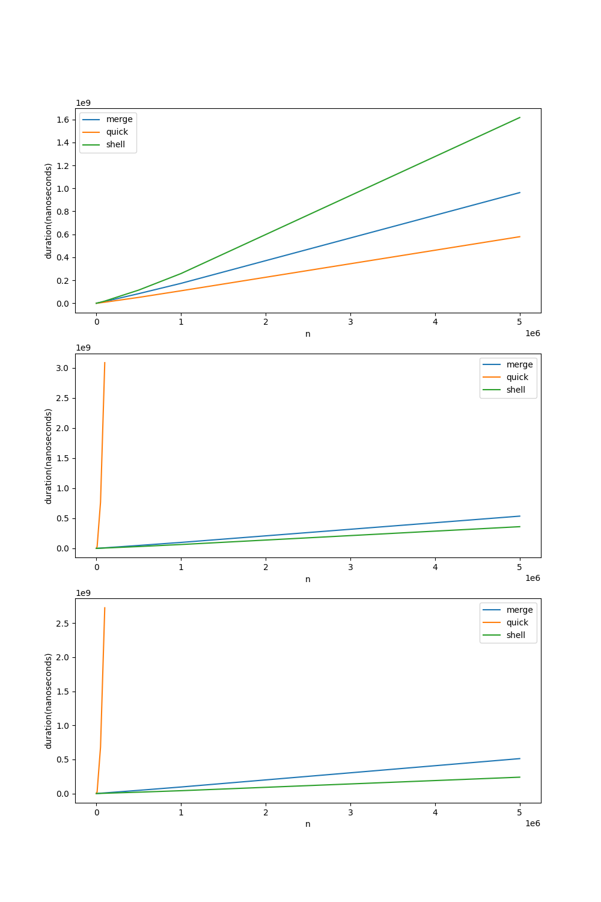
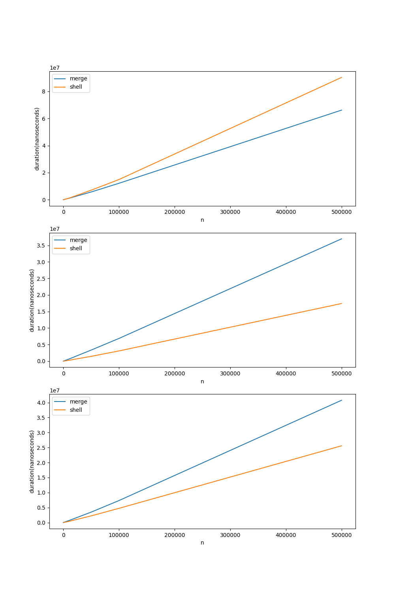

## Plot de Gráficos

Os gráficos abaixo mostram os resultados da execução dos algoritmos de ordenação `Merge Sort`, `Quick Sort` e `Shell Sort`, a fim de avaliar o desempenho em tempo de execução. 

Os algoritmos recebem como entrada os seguintes valores: `1.000` `5.000` `10.000` `50.000` `100.000` `500.000` `1000.000` `5000.000`, que são analisados de três formas: Ordenada, decrescente e aleatoriamente.

Analisando os gráficos, é possível determinar a qualidade do desempenho de cada algoritmo.

### Merge Sort, Quick Sort e Shell Sort

A partir dos resultados, podemos verificar que o algoritmo que obteve o melhor resultado, para a análise ordenada, foi o Shell Sort; para a aleatória e desordenada, Merge Sort.

Obs.: Devido à discrepância nos resultados em comparação com o Quick Sort, optamos por desconsiderar sua análise.

### Merge Sort  e Shell Sort
