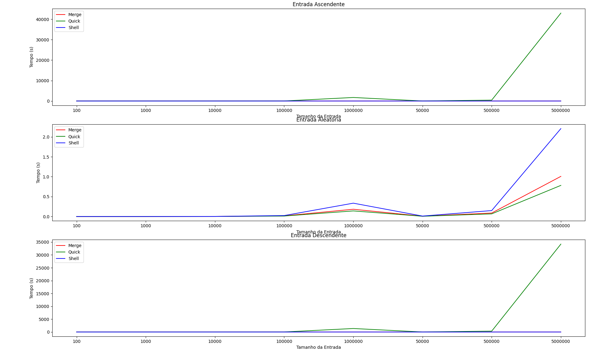

# Equipe 6

Para executar, é necessário estar no Linux ou em um ambiente WSL.

## Como usar o script?

```bash
./rng.sh LIMITE_INFERIOR LIMITE_SUPERIOR QTD_NUMEROS
```

> [!WARNING]
> - `LIMITE_INFERIOR`: Este é o limite inferior do intervalo desejado para os números aleatórios;
> - `LIMITE_SUPERIOR`: Este é o limite superior do intervalo desejado para os números aleatórios;
> - `QTD_NUMEROS`: Este é o número de números aleatórios que você deseja gerar dentro do intervalo especificado.

O script vai gerar os arquivos `o.txt` (ordem ascendente), `d.txt` (ordem descendente) e `a.txt` (ordem aleatória) com os resultados.

<div align="justify">

## Resultados da Comparação entre os Algoritmos

<div align="center">



</div>

Podemos observar que os algoritmos performam de maneira similar para entradas aleatórias, porém o `quick` claramente se destaca pela sua performance subpar em entradas ascendentes e descendentes. Isso se deve ao fato de que estas entradas representam os piores casos para o algoritmo, resultando em uma complexidade de O(n²). Esse resultado poderia ser amenizado com uma escolha mais sábia do pivô, que no caso do algoritmo acima, foi o último elemento do vetor.

## Artigos

### [CUDA-quicksort: an improved GPU-based implementationof quicksort](https://onlinelibrary.wiley.com/doi/epdf/10.1002/cpe.3611)

**1. Algoritmo**

Quicksort, GPU-quicksort, CUDA Dynamic Parallel (CDP) Quicksort, Thrust Radix Sort, Bitonic Sort, Radix Sort e CUDA-quicksort.

**2. Técnica de Paralelismo**

O CUDA-quicksort (algoritmo proposto) realiza o seguinte:

1. No primeiro passo, um pivô é escolhido, e a sequência é particionada para permitir que vários blocos de threads trabalhem em paralelo;
2. Como no GPU-quicksort, um buffer auxiliar é alocado na memória global da GPU, onde os itens com valor maior e menor que o pivô são separados em duas subsequências;
3. Esse processo é então repetido nas duas subsequências no buffer auxiliar;
4. Inicialmente, os blocos de threads ordenam suas partições atribuídas independentemente uns dos outros (ou seja, do resto da sequência);
5. Em particular, cada bloco de threads ordena os elementos de sua partição atribuída em sua memória compartilhada local, separando em dois baldes diferentes os itens com valor menor que o pivô daqueles cujo valor é maior;
6. Através das primitivas atômicas, o buffer auxiliar onde as subsequências serão escritas é dinamicamente particionado;
7. Cada bloco é atribuído a uma partição no buffer auxiliar, para que eles possam escrever simultaneamente seus resultados parciais;
8. Em seguida, cada bloco copia o balde armazenado em sua memória compartilhada local para a partição atribuída;
9. Dessa forma, todos os baldes de cada bloco que mantêm registros de itens menores que o pivô são mesclados em uma única subsequência;
10. A mesma tarefa é realizada ao mesclar todos os baldes que mantêm registros dos itens com valor maior que o pivô na outra subsequência;
11. Por fim, os itens cujo valor é igual ao pivô são escritos entre as duas subsequências;
12. Essas duas subsequências são ordenadas em paralelo, e o processo de ordenação pode ser reiniciado em cada uma delas independentemente.

**3. Linguagem de Programação**

CUDA.

**4. Avaliação Experimental**

<div align="center">


</div>

O artigo descreve experimentos realizados em uma CPU Intel Xeon E5-2667 (2,90 GHz, 12 núcleos) e uma GPU NVIDIA Tesla Kepler K20c, avaliando o desempenho do algoritmo GPU-quicksort. Utilizando distribuições de benchmark de ordenação comuns, os autores analisam o tempo de computação necessário para diferentes tarefas, como seleção de pivô, particionamento, leitura e escrita de subsequências. Eles propõem mudanças para otimizar o desempenho do algoritmo e conduzem experimentos comparativos com outras técnicas de ordenação GPU, como CUDA-quicksort e CDP-quicksort

A avaliação experimental do artigo demonstra o desempenho superior do CUDA-quicksort em relação ao GPU-quicksort e ao CDP-quicksort da NVIDIA, exibindo aproximadamente quatro e três vezes mais rapidez na execução, respectivamente, atribuída principalmente ao acesso otimizado à memória global. Mesmo ao implementar uma versão recursiva usando a tecnologia CDP, o CUDA-quicksort manteve sua execução mais rápida, especialmente em sua forma iterativa. Além disso, ao ser comparado a outros algoritmos avançados de ordenação baseados em GPU, o CUDA-quicksort superou quase todos, exceto o Thrust Radix Sort, na ordenação de grandes sequências de inteiros. No entanto, na ordenação de dados estruturados, o CUDA-quicksort superou o Thrust Radix Sort.

### [Sorting on CUDA](https://digitalcommons.providence.edu/cgi/viewcontent.cgi?article=1000&context=computer_science_students)

**1. Algoritmo**

O Quicksort é um algoritmo de ordenação rápido e eficiente que utiliza a estratégia de dividir para conquistar. Ele escolhe um elemento pivô e rearranja o array de modo que os elementos menores que o pivô estejam à sua esquerda e os maiores estejam à sua direita. Em seguida, recursivamente, ordena as partições. Sua complexidade de tempo médio é O(n log n), tornando-o uma escolha popular para muitas aplicações.

O Bitonic Sort é um algoritmo de ordenação paralela usado em hardware especializado. Ele opera em arrays bitônicos, que primeiro crescem e depois decrescem. O algoritmo usa uma rede de comparação e troca em fases para ordenar o array. Sua complexidade de tempo é O(log^2 n) em paralelo e O(n log^2 n) sequencialmente, o que o torna eficiente para grandes conjuntos de dados.

O Radix Sort é um método de ordenação não comparativo que classifica os elementos com base em dígitos significativos. Ele processa cada dígito individualmente, da ordem menos para a mais significativa, e pode ser implementado usando técnicas como o método de ordenação de contagem ou o método de cubetas. O Radix Sort é eficiente para ordenar números inteiros ou strings de tamanho fixo, com uma complexidade de tempo de O(d * (n + k)), onde d é o número de dígitos, n é o número de elementos e k é a base do sistema numérico.

**2. Técnica de Paralelismo**

**2.1 Quick Sort**

O primeiro indice de início é definido como 0, enquanto o de fim é definido como `N-1`, onde N é o tamanho do conjunto de dados. O código Furthur é executado sob a condição de que o indice da thread, `idx`, seja maior ou igual a zero. Se a condição for atendida, as variáveis `L` e `R` serão definidas como `start[idx]` e `end[idx]`, respectivamente. `L` armazena o indice necessário mais à esquerda do conjunto de dados. Portanto, para começar, ele é definido como zero. Da mesma forma, `R` armazena o índice necessário mais à direita do conjunto de dados. Portanto, para começar, é definido como `Ny = 1`. Se `L` for menor que `R`, então o valor do pivô será definido como o valor armazenado no local `L`.

```
pivo = matriz[L]
```

`array` é o conjunto de dados que contém os números a serem classificados. Os números neste conjunto de dados são então comparados com o pivô. Começamos da direita e diminuímos `R` até que o primeiro valor menor que o pivô seja encontrado. Uma vez encontrado este valor, ele é copiado para a posição `L` no conjunto de dados. Agora, comparamos a partir da esquerda incrementando `L` até que o primeiro valor maior que o pivõ seja encontrado. Este valor é copiado para a posição `R` no conjunto de dados. Este procedimento é repetido enquanto `L` for menor que `R`. Quando `L` e `R` se tomam iguais, copiamos o pivô para esta posição no conjunto de dados. Em seguida, o próximo indice nas matrizes `start` e `end` é definido e o indice atual de `end` é atualizado.

```
valores[L] = pivo
iniciar[idx+1]= L+1; fim[idx+1]-fim[idx]; fiml[idx++]-L
```

Além disso, se a condição:

```
if (fim[idx] - inicio[idx] > fim[idx - 1] - inicio[idx - 1])
```

é verdadeiro, então `start[idx]` é trocado por `start[idx - 1]` e `end[idx]` é trocado por `end[idx - 1]`. Os valores nas matrizes `start` e `end` são usados para atualizar `L` e `R`, respectivamente, quando o código no loop é repetido. Se `L` não for menor que `R`, entretanto, o indice do *thread*, `idx`, é decrementado até que `L` seja definido com um valor menor que `R`. Quando `idx` se torna menor que zero, o conjunto de dados è classificado e a função do *kernel* termina.

**2.2 Bitonic Sort**

**2.3 Radix Sort**

1. Converter a entrada de decimal para binário;
2. Extrair os dígitos necessários de todos os números no conjunto de dados em uma matriz, digamos, `matriz1`;
3. Definir 1 para todas as chaves de classificação falsas (ou 0s) e 0 para todas as chaves de classificação verdadeiras (1s);
4. Armazenar na `matriz2`;
5. contar todos os 1s na `matriz2`, incrementando um contador toda vez que um 1 era encontrado e armazenar o contador em cada etapa na `matriz3`;
6. A `matriz3` agora contém o endereço de destino para cada entrada que produziu uma chave falsa. O número total de chaves falsas para `N` entradas pode ser calculado da seguinte forma: `totalFalso = matriz2[N-1] + matriz3[N-1]`;
7. O endereço de destino para cada entrada que produziu uma chave verdadeira é calculado e armazenado em `matriz4`. O endereço pode ser calculado como: `matriz4[idx] = idx - matrizy3[idx] + totalFalses`;
8. Finalmente, todos os endereços de destino são armazenados em uma matriz e a entrada é reorganizada de acordo. O padrão de endereço de destino é uma permutação perfeita dos índices da matriz de entrada. Portanto, não há conflitos de gravação.

Essas etapas são repetidas para cada bit em uma sequência binária.

**3. Linguagem de Programação**

CUDA.

**4. Avaliação Experimental**

<div align="center">


</div>

O pesquisador implementou e avaliou os resultados para algoritmos de classificação paralela para classificação rápida, classificação bitônica e classificação radix em CUDA. Dentre elas, os algoritmos de classificação paralela se mostraram os mais eficientes para grandes volumes de dados, em especial o algoritmo de classificação bitônica.

</div>
