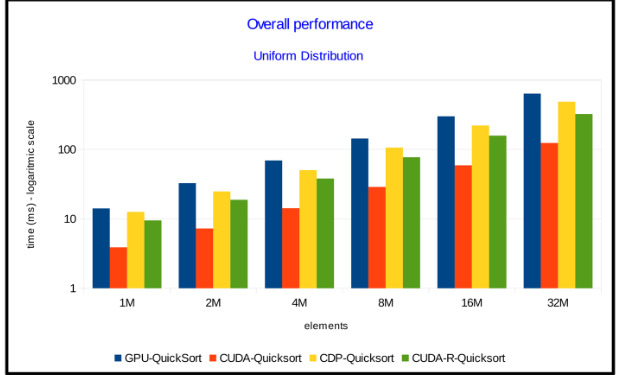
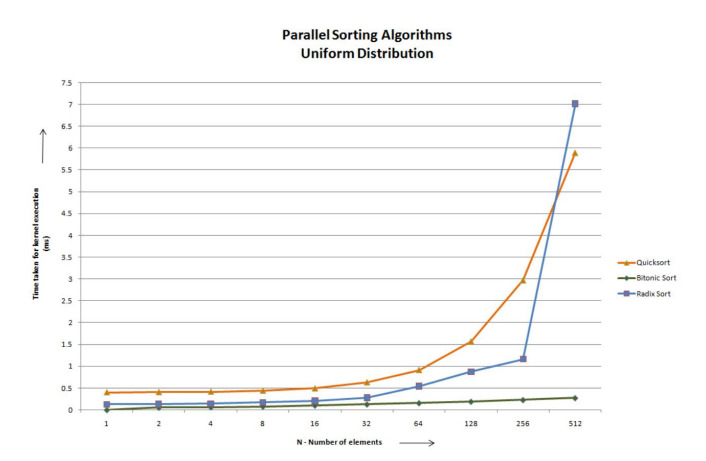

# Equipe 6

Para executar, é necessário estar no Linux ou em um ambiente WSL.

## Como usar o script?

```bash
./rng.sh LIMITE_INFERIOR LIMITE_SUPERIOR QTD_NUMEROS
```

> [!WARNING]
> - `LIMITE_INFERIOR`: Este é o limite inferior do intervalo desejado para os números aleatórios;
> - `LIMITE_SUPERIOR`: Este é o limite superior do intervalo desejado para os números aleatórios;
> - `QTD_NUMEROS`: Este é o número de números aleatórios que você deseja gerar dentro do intervalo especificado.

O script vai gerar os arquivos `o.txt` (ordem ascendente), `d.txt` (ordem descendente) e `a.txt` (ordem aleatória) com os resultados.

## Artigos

### [CUDA-quicksort: an improved GPU-based implementationof quicksort](https://onlinelibrary.wiley.com/doi/epdf/10.1002/cpe.3611)

**1. Algoritmo**

Quicksort, GPU-quicksort, CUDA Dynamic Parallel (CDP) Quicksort, Thrust Radix Sort, Bitonic Sort, Radix Sort e CUDA-quicksort.

**2. Técnica de Paralelismo**

O CUDA-quicksort (algoritmo proposto) realiza o seguinte:

1. No primeiro passo, um pivô é escolhido, e a sequência é particionada para permitir que vários blocos de threads trabalhem em paralelo;
2. Como no GPU-quicksort, um buffer auxiliar é alocado na memória global da GPU, onde os itens com valor maior e menor que o pivô são separados em duas subsequências;
3. Esse processo é então repetido nas duas subsequências no buffer auxiliar;
4. Inicialmente, os blocos de threads ordenam suas partições atribuídas independentemente uns dos outros (ou seja, do resto da sequência);
5. Em particular, cada bloco de threads ordena os elementos de sua partição atribuída em sua memória compartilhada local, separando em dois baldes diferentes os itens com valor menor que o pivô daqueles cujo valor é maior;
6. Através das primitivas atômicas, o buffer auxiliar onde as subsequências serão escritas é dinamicamente particionado;
7. Cada bloco é atribuído a uma partição no buffer auxiliar, para que eles possam escrever simultaneamente seus resultados parciais;
8. Em seguida, cada bloco copia o balde armazenado em sua memória compartilhada local para a partição atribuída;
9. Dessa forma, todos os baldes de cada bloco que mantêm registros de itens menores que o pivô são mesclados em uma única subsequência;
10. A mesma tarefa é realizada ao mesclar todos os baldes que mantêm registros dos itens com valor maior que o pivô na outra subsequência;
11. Por fim, os itens cujo valor é igual ao pivô são escritos entre as duas subsequências;
12. Essas duas subsequências são ordenadas em paralelo, e o processo de ordenação pode ser reiniciado em cada uma delas independentemente.

**3. Linguagem de Programação**

CUDA.

**4. Avaliação Experimental**

<center>



</center>

A avaliação experimental do artigo demonstra o desempenho superior do CUDA-quicksort em relação ao GPU-quicksort e ao CDP-quicksort da NVIDIA, exibindo aproximadamente quatro e três vezes mais rapidez na execução, respectivamente, atribuída principalmente ao acesso otimizado à memória global. Mesmo ao implementar uma versão recursiva usando a tecnologia CDP, o CUDA-quicksort manteve sua execução mais rápida, especialmente em sua forma iterativa. Além disso, ao ser comparado a outros algoritmos avançados de ordenação baseados em GPU, o CUDA-quicksort superou quase todos, exceto o Thrust Radix Sort, na ordenação de grandes sequências de inteiros. No entanto, na ordenação de dados estruturados, o CUDA-quicksort superou o Thrust Radix Sort.

### [Sorting on CUDA](https://digitalcommons.providence.edu/cgi/viewcontent.cgi?article=1000&context=computer_science_students)

**1. Algoritmo**

Quicksort, Bitonic Sort e Radix Sort.

**2. Técnica de Paralelismo**

EM PROGRESSO.

**2.1 Técnica de Paralelismo**

**2.2 Técnica de Paralelismo**

**2.3 Técnica de Paralelismo**

**3. Linguagem de Programação**

CUDA.

**4. Avaliação Experimental**

<center>



</center>

O pesquisador implementou e avaliou os resultados para algoritmos de classificação paralela para classificação rápida, classificação bitônica e classificação radix em CUDA. Dentre elas, os algoritmos de classificação paralela se mostraram os mais eficientes para grandes volumes de dados, em especial o algoritmo de classificação bitônica.
